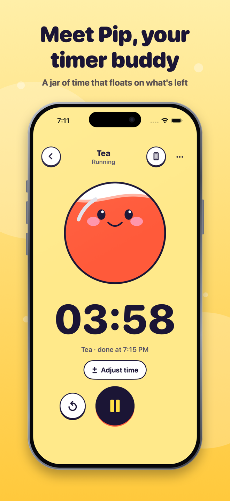
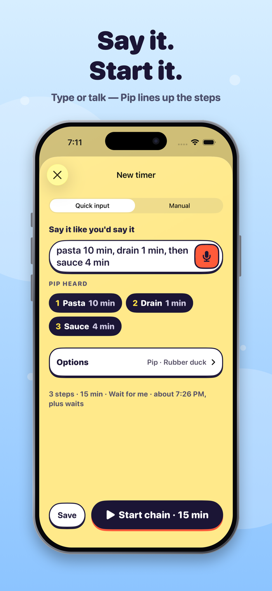
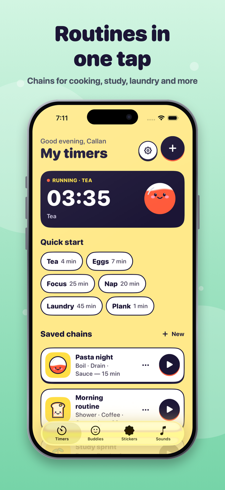
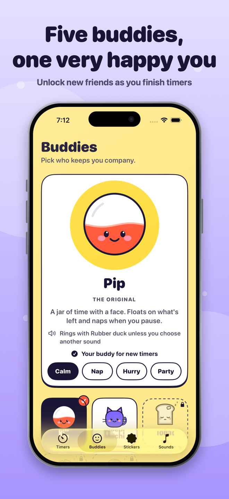

  

<h1 align="center">Pip</h1>

<strong>Your friendly timer buddy for iPhone.</strong> 
One countdown or a whole routine — easy to start, calm to follow.

  <a href="https://callan-watkins.github.io/pip-timer/">Website</a> ·
  <a href="https://callan-watkins.github.io/pip-timer/support.html">Support</a> ·
  <a href="https://callan-watkins.github.io/pip-timer/privacy.html">Privacy</a> ·
  <a href="https://callan-watkins.github.io/pip-timer/terms.html">Terms</a>

  
  
  
  

## What Pip does

- **A buddy on your time.** Pip floats on the time you have left, naps when you pause and perks up near the end. Four more buddies unlock as you finish timers.
- **Say it or type it.** *"Focus 25 min then break 5 min, repeat 4 times"* becomes editable steps you review before anything starts. Prefer buttons? Use manual entry.
- **Routines in one tap.** Save chains such as *Pasta night* or *Study sprint*. Each chain either **waits for you** between steps or runs **automatically** with one alarm at the end.
- **Alarms you can trust.** With your permission Pip uses iOS system alarms (timers can show on the Lock Screen and Dynamic Island). Or use normal notifications, or keep timers in the app. Pip always shows which one a timer uses.
- **A sound for every buddy.** Each buddy rings with its own sound; pick one sound for everything, or one for a single timer.
- **Gentle by design.** No streaks and no guilt. Quiet display, dark mode, Dynamic Type, VoiceOver and Reduce Motion support.
- **Private.** No account, no ads, no analytics, no network. Everything stays on your iPhone.

## Free and Pip Pro

Timers, alarms, widgets and the Lock Screen countdown are always free.

| | Free | Pip Pro |
|---|---|---|
| Timers at once | 2 | 4 |
| Saved chains | 6 | Unlimited |
| Steps per chain | 5 | 12 |
| Repeats per chain | 4 | 8 |
| History shown | Latest 10 | Latest 100 |
| Sounds | 6 | 10 |
| Color themes | Sunny | 5 |

Pip Pro is an optional monthly subscription ($4.99/month, price varies by country) that renews automatically until cancelled. Manage it in your Apple Account settings.

## Requirements

iPhone with iOS 26 or later.

## Support

Email **[callans.creations1@gmail.com](mailto:callans.creations1@gmail.com)** or see the [support page](https://callan-watkins.github.io/pip-timer/support.html).

## About this repository

This repository hosts Pip's public website and marketing material. The app's source code is not published here.

---

© 2026 Callan Watkins. Pip is a convenience timer, not a medical, safety or cooking-safety tool. Apple, iPhone and the App Store are trademarks of Apple Inc.
